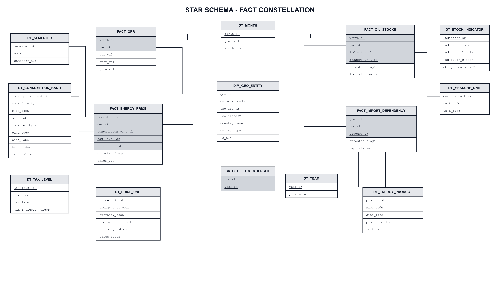

# Data Warehouse Modeling — Fact Constellation Architecture

This document describes the conceptual and logical data modeling of the **Energy Security Data Warehouse**.

The analytical system is designed as an integrated **Fact Constellation Schema** (also known as *Enterprise Star Constellation*) composed of 4 analytical processes sharing conformed dimensions.

---

## 1. Integrated Fact Constellation Diagram

---

## 2. Dimension Sharing Matrix

The table below shows which dimensions are shared across the four fact tables:

| Fact Table | `DIM_GEO_ENTITY` (Conformed) | `DT_MONTH` (Monthly) | `DT_SEMESTER` (Half-Yearly) | `DT_YEAR` (Annual) | `BR_GEO_EU_MEMBERSHIP` (Historical Bridge) | Process Dimensions |
| :--- | :---: | :---: | :---: | :---: | :---: | :--- |
| **`FACT_GPR`** | **X** | **X** | | | | *(None - global index)* |
| **`FACT_ENERGY_PRICE`** | **X** | | **X** | | | `DT_CONSUMPTION_BAND`, `DT_TAX_LEVEL`, `DT_PRICE_UNIT` |
| **`FACT_OIL_STOCKS`** | **X** | **X** | | | | `DT_STOCK_INDICATOR`, `DT_MEASURE_UNIT` |
| **`FACT_IMPORT_DEPENDENCY`**| **X** | | | **X** | | `DT_ENERGY_PRODUCT` |
| *Bridge Navigation* | **X** | | | **X** | **X** | *(Historical membership: EU enlargement & Brexit)* |

---

## 3. Core Architectural Decisions

### 1. Multi-Grain Temporal Dimensions
Rather than forcing all datasets into a single artificial daily or annual grain, the warehouse preserves the native frequency of each official source:
* **`DT_MONTH`**: supports monthly observations (`FACT_GPR`, `FACT_OIL_STOCKS`);
* **`DT_SEMESTER`**: supports half-yearly electricity and gas price series (`FACT_ENERGY_PRICE`);
* **`DT_YEAR`**: supports annual energy balance and dependency rates (`FACT_IMPORT_DEPENDENCY`).

The three temporal dimensions are hierarchically aligned through `year_val` / `year_sk`, enabling sound roll-up and drill-across operations without synthetic date keys.

### 2. Conformed Geography (`DIM_GEO_ENTITY`)
The geographic dimension unifies all territorial entities across Eurostat datasets and the global GPR index:
* Individual countries (mapped with ISO Alpha-2 and Alpha-3 codes);
* Eurostat geopolitical aggregates (e.g., `EU27_2020`, `EA20`);
* A conformed `GLOBAL` dummy entity (`geo_sk = 1`) used for worldwide baseline metrics.

### 3. Historical European Union Membership (`BR_GEO_EU_MEMBERSHIP`)
EU membership is dynamic over time (enlargements from 6 to 28 members, and the 2020 Brexit transition). The bridge table captures historical membership on a year-by-year basis, allowing OLAP queries to filter dynamically by actual historical EU members or compare constant composition panels.

### 4. Non-Additive and Level Measures
* **Prices, dependency rates, and GPR indices** are *unit / intensive measures*: they cannot be meaningfully summed (`SUM` is strictly prohibited). Aggregations along time and space use `AVG`, `MIN`, or `MAX` in homogeneous contexts.
* **Emergency oil stocks** are *level measures* (inventory snapshot at the end of each month). They are semi-additive (can be summed across space for identical indicators and units, but never summed across time).

---

## 4. Specific Process Schemas and DFM

Detailed individual diagrams are available in subdirectories:
* **`dfm/`**: Dimensional Fact Model trees (conceptual diagrams showing fact nodes, dimensions, hierarchies, and non-additive measure annotations).
* **`star-schema/`**: Individual relational Star Schema diagrams for each isolated fact.
