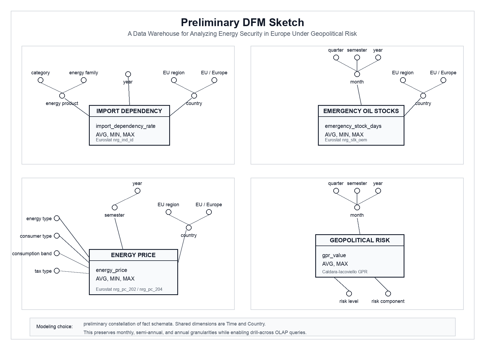

# Preliminary DFM Sketch

**Project:** A Data Warehouse for Analyzing Energy Security in Europe Under Geopolitical Risk

The preliminary DFM is modeled as a constellation of fact schemata sharing common `Time` and `Country` dimensions. This choice is motivated by the heterogeneous granularity of the selected datasets: emergency oil stocks and geopolitical risk are monthly, energy prices are semi-annual, and import dependency is annual.

## Fact Schemata

### Import Dependency

- **Measure:** `import_dependency_rate`
- **Dataset:** Eurostat `nrg_ind_id`
- **Dimensions:** `Time`, `Country`, `Energy Product`

### Emergency Oil Stocks

- **Measure:** `emergency_stock_days`
- **Dataset:** Eurostat `nrg_stk_oem`
- **Dimensions:** `Time`, `Country`

### Energy Price

- **Measure:** `energy_price`
- **Datasets:** Eurostat `nrg_pc_202`, Eurostat `nrg_pc_204`
- **Dimensions:** `Time`, `Country`, `Energy Type`, `Consumer Type`, `Consumption Band`, `Tax Type`

### Geopolitical Risk

- **Measure:** `gpr_value`
- **Dataset:** Caldara-Iacoviello GPR Index
- **Dimensions:** `Time`, `Risk Level`, `Risk Component`

## Main Dimensional Hierarchies

- `Time`: the root depends on the fact granularity:
  - `Import Dependency`: `year`
  - `Energy Price`: `semester -> year`
  - `Emergency Oil Stocks` and `Geopolitical Risk`: `month -> quarter`, `month -> semester`, `month -> year`
- `Country`: `country -> EU region`, `country -> EU / Europe`
- `Energy Product`: `energy product -> product category`, `energy product -> energy family`
- `Risk Level`: derived during ETL from the GPR value and used as an analysis coordinate
- `Risk Component`: distinguishes the GPR series, such as general index, threats, and acts

## Granularity Note

Monthly facts such as geopolitical risk and emergency oil stocks can be aggregated to semester and year levels. Semi-annual energy prices are analyzed at semester level, while annual import dependency is used as a yearly contextual indicator. Since most measures are rates, prices, levels, or indexes, aggregation should mainly use `AVG`, `MIN`, and `MAX`, not `SUM`.

